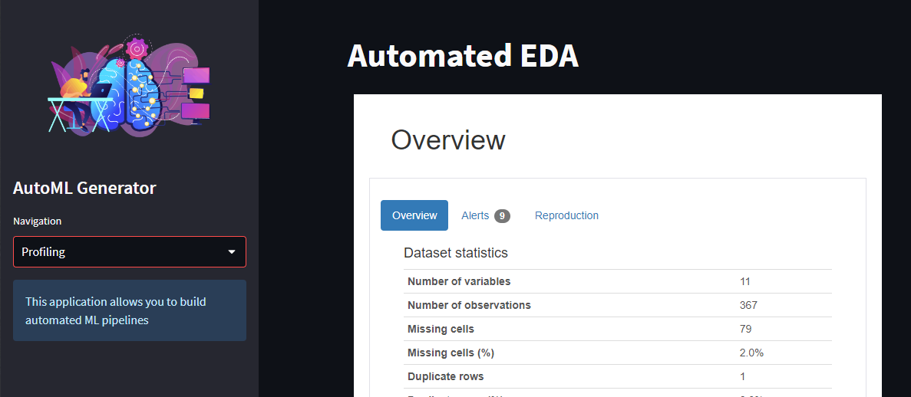
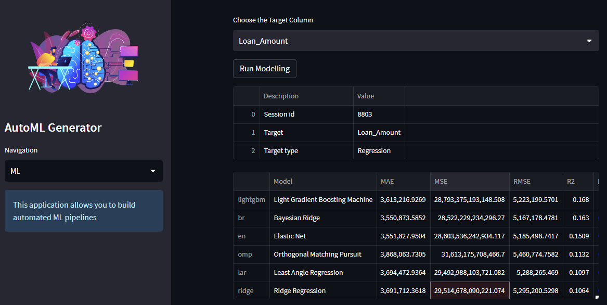

# AutoML Generator

AutoML Generator is an automated machine learning pipeline building tool that allows users to upload a dataset, perform automated exploratory data analysis (EDA), run modeling, and download the best model.

## Installation

1. Clone the repository to your local machine:

```
git clone https://github.com/JPCLima/AutoML-Generator
```

2. Navigate to the directory where you cloned the repository:

```
cd AutoML-Generator
```

3. Create a virtual environment:

```
python -m venv env
```

4. Activate the virtual environment

```
env\Scripts\activate
```

5. Install the required packages:

```
pip install -r requirements.txt
```

## Usage

1. Run the application:

```
streamlit run app.py
```

2. The application will open in your default browser.

3. Use the sidebar to navigate between the Upload, Profiling, ML, and Download sections.

4. In the "Upload" section, upload a dataset for modeling. The uploaded dataset is saved as a CSV file named "sourcedata.csv".

5. In the "Profiling" section, the application performs automated EDA on the uploaded dataset using the ydata_profiling library.

6. In the "ML" section, choose the target column and run modeling on the uploaded dataset using the pycaret.regression library. The best model is saved as "best_model.pkl".

7. In the "Download" section, click the "Download Model" button to download the best model as a file named "best_model.pkl".

## Screenshots

Here are some screenshots of the project in action:

- Profiling view
  

- ML view
  
